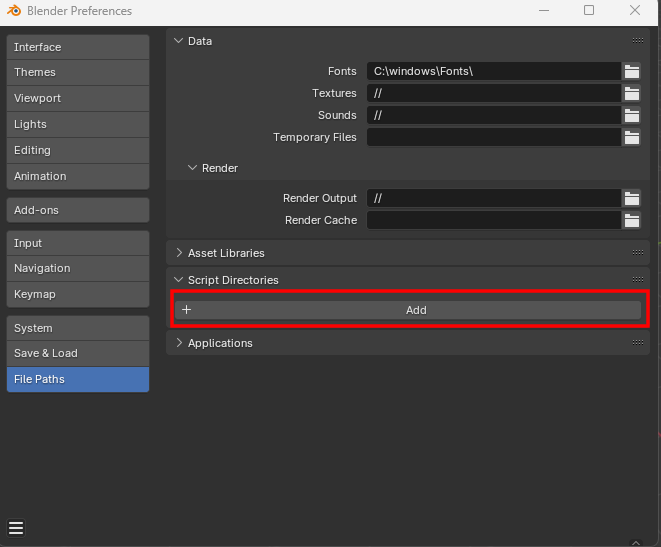

# Attaching a debugger to the glTF-Blender-IO addon

These instructions are considered experimental.  They describe how to attach a Python debugger from VSCode to Blender, using a 3rd-party addon called [blender-debugger-for-vscode](https://github.com/AlansCodeLog/blender-debugger-for-vscode).

## Installation

1. If not already installed, download and install [Visual Studio Code](https://code.visualstudio.com/) ("VSCode").

2. If not already installed, download and install [Python](https://www.python.org/downloads/) 3.x.  It includes a package manager named "pip" that should also be installed.

3. Launch VSCode, go to the "Extensions" tab, and install the `ms-python.python` extension from the "recommended" list.  (For more info see the [market page](https://marketplace.visualstudio.com/items?itemName=ms-python.python)).

4. In the "Extensions" tab, install the Blender Development extension from JacquesLucke. (For more information see the [market page](https://marketplace.visualstudio.com/items?itemName=JacquesLucke.blender-development))

5. Remove the existing `scripts/addons/io_scene_gltf2` folder from the Blender install folder, as this method will use the git source tree instead.

6. In Blender -> Edit -> Preferences -> Interface -> Display, there is a checkbox for "Developer Extras."  Turn that on.

7. In Blender -> Edit -> Preferences -> File Paths -> Script Directories, click the "Add" button. Paste in the full path to the glTF-Blender-IO local git repository on your drive.  Save the preferences.




## Usage

In VSCode, open the command palette with `F1` or `Ctrl+Shift+P` (or `Cmd+Shift+P` on mac) to open the command palette. Type `Blender: Build and Start` into the command palette and select that option. In the next menu select `Choose a new Blender executable` and enter the path to the Blender executable to the version of your choice

If this has been successful then Blender will launch and `Debug client attached` will be printed to the VSCode console.

If you want changes you have made in VSCode and to be reflected in the version of Blender launched by VSCode, you can reload the addon that is installed into Blender by entering `Blender: Reload Addons` into the command palette.

To reload the addon every time a file is saved, active the blender.addon.reloadOnSave setting in VS Code.

## Sample Breakpoint

Look for a line in `__init__.py` at the end of `def invoke` that looks like this:

```
        return ExportHelper.invoke(self, context, event)
```

Try placing a breakpoint on this line by clicking to the left of the line number, to place a red dot there.  Then, in Blender, go to File -> Export -> glTF.  Blender's entire UI should immediately lock up, and VSCode should show the execution halted on the breakpoint.

Once a breakpoint is hit, you can inspect the call stack in the left window, and interrogate local variables with the `DEBUG CONSOLE` window at the bottom.

See the documentation and video included with [blender-vscode](https://github.com/JacquesLucke/blender_vscode) for additional capabilities not covered here.


## Stop Debugging

In VSCode, the far-right icon on the debug toolbar is a red square with a disconnected plug, with a "Disconnect" tool-tip.  Clicking this will detach the debugger and let Blender continue. However, as Blender was launched from VSCode, closing the shell that launched Blender (and therefore exiting VSCode) will close Blender.
