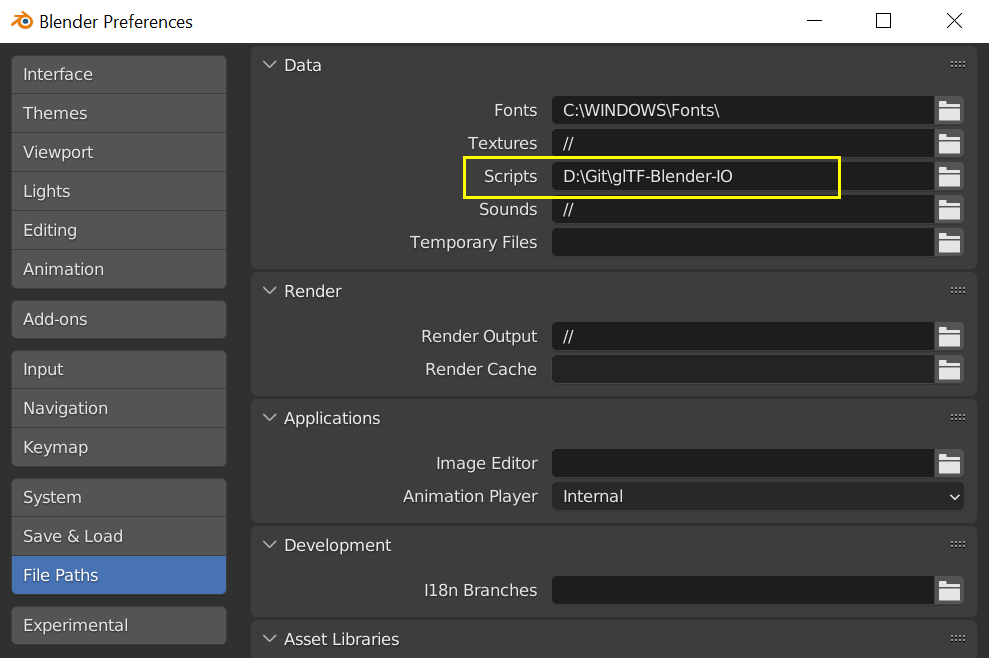

# Attaching a debugger to the glTF-Blender-IO addon

These instructions are considered experimental.  They describe how to attach a Python debugger from VSCode to Blender, using a 3rd-party addon called [blender-debugger-for-vscode](https://github.com/AlansCodeLog/blender-debugger-for-vscode).

## Installation

1. If not already installed, download and install [Visual Studio Code](https://code.visualstudio.com/) ("VSCode").

2. If not already installed, download and install [Python](https://www.python.org/downloads/) 3.x.  It includes a package manager named "pip" that should also be installed.

3. Open a new command shell and type `pip install debugpy`.  Debugpy is a Python debug server for VSCode, replacing an older tool called "ptvsd".  ([source code on GitHub](https://github.com/microsoft/debugpy))

4. Launch VSCode, go to the "Extensions" tab, and install the `ms-python.python` extension from the "recommended" list.  (For more info see the [market page](https://marketplace.visualstudio.com/items?itemName=ms-python.python)).

5. Remove the existing `scripts/addons/io_scene_gltf2` folder from the Blender install folder, as this method will use the git source tree instead.

6. In Blender -> Edit -> Preferences -> Interface -> Display, there is a checkbox for "Developer Extras."  Turn that on.

7. In Blender -> Edit -> Preferences -> File Paths, there is a blank entry for "Scripts" about 3rd from the top.  Paste in the full path to the glTF-Blender-IO local git repository on your drive.  Save the preferences.



8. Download the [blender-debugger-for-vscode](https://github.com/AlansCodeLog/blender-debugger-for-vscode) addon. Place it in the addons/ folder of the glTF-Blender-IO git repository. By installing the debugging addon there, instead of in the default Blender addons directory, you'll be able to keep it installed when upgrading Blender later.

9. In Blender -> Edit -> Preferences -> Add-ons, search for the word "Debug", and enable the addon "Development: Debugger for VS Code".  It should automatically pick up the location of where debugpy was installed on this panel.  Save the preferences.

10. Quit and re-start Blender.  Make sure the glTF import/export options are available, indicating the addon is running from the new location.

## Usage

1. In Blender, press <kbd>F3</kbd> to bring up the tools search window.  Search for the word "Debug", and then click "Debug: Start Debug Server for VS Code."

2. In VSCode, with the glTF-Blender-IO folder opened, press <kbd>F5</kbd> or choose "Start Debugging" from the Debug menu.

If both actions happen within 20 seconds or so, you may see a console message in VSCode saying "Debugger is attached."  If not, it may have just silently worked, but you can check: Go back to Blender and find the tool "Debug: Check if VS Code is Attached" and run that.  It should also produce the "Debugger is Attached" message.

## Sample Breakpoint

Look for a line in `__init__.py` at the end of `def invoke` that looks like this:

```
        return ExportHelper.invoke(self, context, event)
```

Try placing a breakpoint on this line by clicking to the left of the line number, to place a red dot there.  Then, in Blender, go to File -> Export -> glTF.  Blender's entire UI should immediately lock up, and VSCode should show the execution halted on the breakpoint.

Once a breakpoint is hit, you can inspect the call stack in the left window, and interrogate local variables with the `DEBUG CONSOLE` window at the bottom.

See the documentation and video included with [blender-debugger-for-vscode](https://github.com/AlansCodeLog/blender-debugger-for-vscode) for additional capabilities not covered here.

## Stop Debugging

In VSCode, the far-right icon on the debug toolbar is a red square with a disconnected plug, with a "Disconnect" tool-tip.  Clicking this will detach the debugger and let Blender continue.  The debugpy server is likely still running for the remainder of the Blender session, so you can re-attach by asking VSCode to launch the debugger again.
