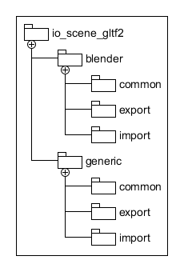
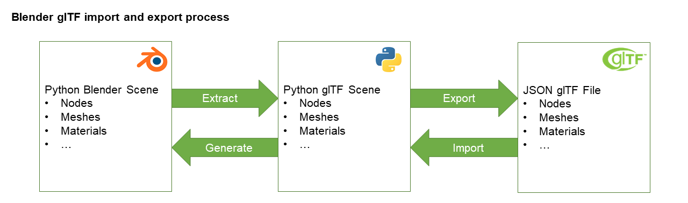

 

Blender glTF 2.0 Importer and Exporter
======================================

Documentation
-------------

| Blender Version | Documentation |
|---------|---------------------|
| 4.1    | https://docs.blender.org/manual/en/4.1/addons/import_export/scene_gltf2.html  |
| dev    | https://docs.blender.org/manual/en/dev/addons/import_export/scene_gltf2.html  |

Notes:
* 4.1 is the current stable release. Check the `blender-v4.1-release` branch (and `4.1.x` tag)
* 4.2 will be the next stable release. Check the `main` branch.
* 2.80 - 4.0 are previous stable releases.
* 3.6.x is the current Blender LTS release. Check the `blender-v3.6-release` branch (and `3.6.x` tag)
* main branch of this addon is mirrored in [Blender Addons main](https://projects.blender.org/blender/blender-addons/src/branch/main/io_scene_gltf2), that will become Blender 4.2.

### Legacy 2.79 Support

The final version of this addon with legacy support for Blender 2.79 is available on the [2.79 Release Page](https://github.com/KhronosGroup/glTF-Blender-IO/releases/tag/2.79).

Blender 2.80 and higher bundle this addon in the main Blender install package, so no 3rd-party install is required.

Credits
-------

Developed by [UX3D](https://www.ux3d.io/), Scurest and [Julien Duroure](http://julienduroure.com/), with support from the [Khronos Group](https://www.khronos.org/), [Mozilla](https://www.mozilla.org/), and [Airbus Defense & Space](https://www.airbus.com/space.html).

Introduction
------------

Official Khronos Group Blender [glTF](https://www.khronos.org/gltf/) 2.0 importer and exporter.

This project contains all features from the [previous exporter](https://github.com/KhronosGroup/glTF-Blender-Exporter), and all future development will happen on this repository. In addition, this repository contains a Blender importer, with common Python code shared between exporter and importer for round-trip workflows. New features are included or under development, but usage and menu functionality remain the same.

The shared codebase is organized into common (Blender-independent) and Blender-specific packages:

Package organisation

This structure allows common code to be reused by third-party Python packages working with the glTF 2.0 format.

Import & export process

The main importer and exporter interface is the Python glTF scene representation.
Blender scene data is first extracted and converted into this scene description. This glTF scene description is exported to the final JSON glTF file. Any compression of mesh, animation, or texture data happens here.
For import, glTF data is parsed and written into the Python glTF scene description. Any decompression is executed in this step. Using the imported glTF scene tree, the Blender internal scene representation is generated from this information.

Installation
------------

The Khronos glTF 2.0 importer and exporter is enabled by default in [Blender 2.8](https://www.blender.org/2-8/) and higher. To reinstall it — for example, when testing recent or upcoming changes — copy the `addons/io_scene_gltf2` folder into the `scripts/addons_core/` directory of the Blender installation, then enable it under the *Add-ons* tab. For additional development documentation, see [Debugging](DEBUGGING.md).

Debugging
---------

- [Debug with PyCharm](https://code.blender.org/2015/10/debugging-python-code-with-pycharm) **NOTE:** If you are using Blender 2.80+, you need the [updated debugger script](https://github.com/ux3d/random-blender-addons/blob/master/remote_debugger.py)
- [Debug with VSCode](DEBUGGING.md)

Continuous Integration Tests
----------------------------

Several companies, individuals, and glTF community members contribute to Blender glTF I/O. Functionality is added and bugs are fixed regularly. Because hobbyists and professionals using Blender glTF I/O rely on its stability for their daily work, continuous integration tests are enabled. After each commit or pull request, the following tests are run:

-	Export Blender scene and validate using the [glTF validator](https://github.com/KhronosGroup/glTF-Validator/)
-	Round trip import-export and comparison of glTF validator results

These quality-assurance checks improve the reliability of Blender glTF I/O.

Running the Tests Locally
-------------------------

To run the tests locally, your system should have a `blender` executable in the path that launches the desired version of Blender.

The latest version of [Yarn](https://yarnpkg.com/en/) should also be installed.

Then, in the `tests` folder of this repository, run `yarn install`, followed by `yarn run test`.

Main branch
-----------

The main branch was renamed on 2023 January, 12th.
If you need to update your local repository, you can use the [following documentation](https://docs.github.com/en/repositories/configuring-branches-and-merges-in-your-repository/managing-branches-in-your-repository/renaming-a-branch#updating-a-local-clone-after-a-branch-name-changes)

Some Technical documentation
----------------------------

Want to fix some bugs or add some enhancement? You will find some technical overview of this addon [here](Technical.md)
